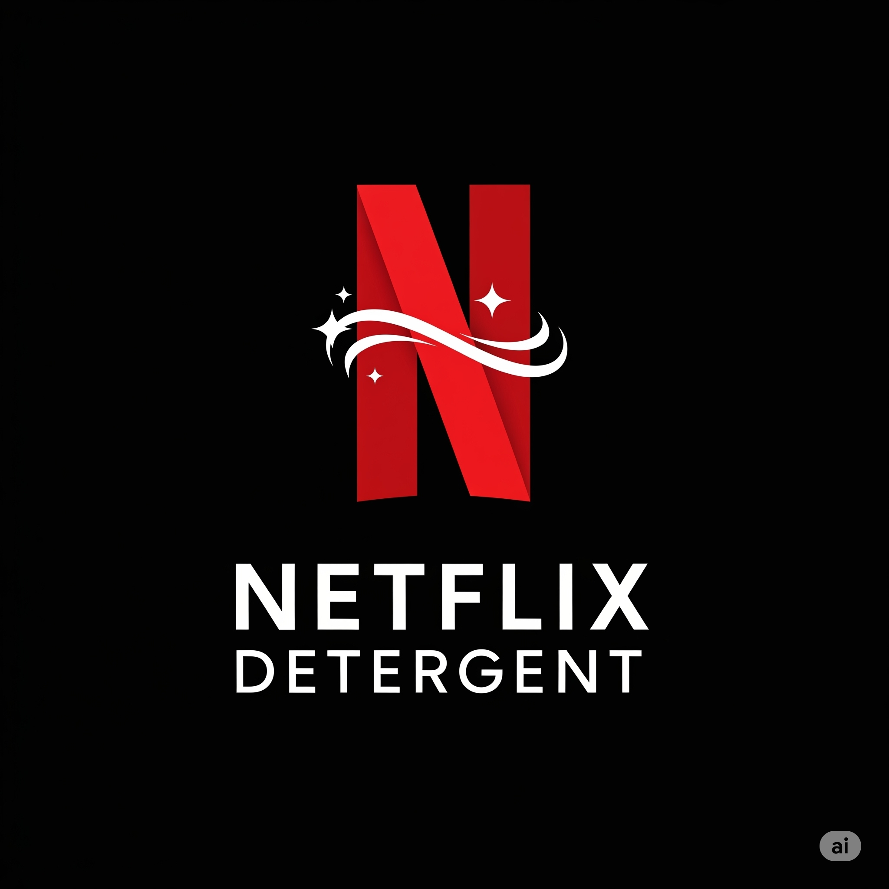

# 🎬 Netflix Detergent
### *"Now Streaming Freshness. Clean Has Never Been This Cinematic."*

[](https://reactjs.org/)
[](https://tailwindcss.com/)
[](https://netflix.com)

---

## 🌟 Overview

**Netflix Detergent** is a wildly creative, fully interactive parody website that reimagines what would happen if Netflix launched their own luxury detergent line. This isn't just a website—it's a complete entertainment experience that turns laundry into a binge-worthy streaming session.

Built with cutting-edge frontend technologies, this project showcases the power of creative UI/UX design, interactive animations, and Netflix-authentic styling to create an unforgettable user experience.

---
PowerPoint Presentation of the Project:
[Click to view](https://docs.google.com/presentation/d/1PxpQKsQLNPFJD_qz3GhIn0ovXHfBiCeS/edit?usp=drive_link&ouid=104734464690108009245&rtpof=true&sd=true)
- **Project Repository**: [GitHub Link](https://github.com/IEEESCE/Decrypts)
- **Demo Site**: [Live Demo Link](https://remarkable-bavarois-c11632.netlify.app/)
- **Issues**: Report bugs or request features via GitHub Issues
- **Demo Video** :[Live Demo Video](https://drive.google.com/file/d/1mxswtPV1hO3qI9OpRQ6pKoQTmE6acY7R/view?usp=drive_link)
## 🎭 Features

### 🎬 **Core Experience**
- **Netflix-Style Loading Screen** with ta-dum sound effects and spinning detergent bottle
- **Cinematic Hero Section** with floating bubble animations and 3D spinning bottle
- **Netflix-Authentic UI** with exact color schemes, typography, and styling
- **Responsive Design** that works seamlessly across all devices

### 🧼 **Product Experience**
- **Netflix-Style Carousel** for genre-scented detergent collection
- **Interactive Product Trailers** with full Netflix video player controls
- **Genre-Themed Products** (Action, Romance, Thriller, Comedy, Drama)
- **AI-Powered MoodMatch™** system for personalized scent recommendations

### 🎮 **Interactive Features**
- **Washing Machine Theater** - Turn your laundry into a blockbuster movie experience
- **Interactive Detergent Laboratory** - Mix and match genres to create custom bottles
- **Real-Time Sound Visualizer** with genre-specific audio effects
- **Binge Washing Streaks** - Gamification system with XP, levels, and achievements
- **Netflix-Style Video Players** with skip intro, continue watching, and more

### 🔮 **Advanced Functionality**
- **Local Storage Persistence** for user stats, achievements, and custom bottles
- **Particle Systems** and real-time animations throughout
- **Audio Simulation System** with visual feedback and controls
- **Easter Eggs** including KonMari references and "Are you still rinsing?" popups
- **Achievement System** with Netflix-style unlock animations

---

## 🚀 Getting Started

### Prerequisites
- Node.js (v16 or higher)
- npm or yarn package manager

### Installation

1. **Clone the repository**
   ```bash
   git clone https://github.com/devananda6200/Netflix-detergent-spinhack
   cd Decrypts
   ```

2. **Install dependencies**
   ```bash
   cd frontend
   npm install
   # or
   yarn install
   ```

3. **Start the development server**
   ```bash
   npm start
   # or
   yarn start
   ```

4. **Open your browser**
   Navigate to `http://localhost:3000` and experience the magic!

---

## 🎨 Tech Stack

### **Frontend Framework**
- **React 19** - Latest React with concurrent features
- **React Router** - Client-side routing
- **React Hooks** - Modern state management

### **Styling & UI**
- **Tailwind CSS** - Utility-first CSS framework
- **shadcn/ui Components** - High-quality UI components
- **Custom Animations** - CSS and JavaScript-powered effects
- **Responsive Design** - Mobile-first approach

### **State Management**
- **React Context** - Global state management
- **Local Storage** - Persistent user data
- **Session Storage** - Loading screen optimization

### **Interactive Features**
- **Custom Hooks** - Reusable logic components
- **Event Handlers** - Mouse, keyboard, and scroll interactions
- **Animation Libraries** - Smooth transitions and effects

---

## 📁 Project Structure

```
netflix-detergent/
├── frontend/
│   ├── public/
│   ├── src/
│   │   ├── components/
│   │   │   ├── ui/                    # shadcn/ui components
│   │   │   ├── AudioSimulator.jsx     # Sound effect simulation
│   │   │   ├── BingeWashingStreaks.jsx # Gamification system
│   │   │   ├── EasterEggs.jsx         # Hidden features
│   │   │   ├── FeatureShowcase.jsx    # Netflix-style features
│   │   │   ├── Footer.jsx             # Site footer
│   │   │   ├── HeroSection.jsx        # Landing hero section
│   │   │   ├── InteractiveBottleLab.jsx # Custom bottle creator
│   │   │   ├── MoodMatcher.jsx        # AI mood matching
│   │   │   ├── NetflixCarousel.jsx    # Product carousel
│   │   │   ├── NetflixLoadingScreen.jsx # Loading screen
│   │   │   ├── NetflixVideoPlayer.jsx  # Video player component
│   │   │   ├── PricingPlans.jsx       # Subscription plans
│   │   │   ├── ProductShowcase.jsx    # Product display
│   │   │   ├── SoundVisualizer.jsx    # Audio visualizer
│   │   │   ├── Testimonials.jsx       # User reviews
│   │   │   └── WashingMachineTheater.jsx # Interactive theater
│   │   ├── data/
│   │   │   └── mockData.js            # All mock data
│   │   ├── hooks/
│   │   │   └── use-toast.js           # Toast notifications
│   │   ├── App.js                     # Main app component
│   │   └── index.js                   # React entry point
│   ├── package.json
│   └── tailwind.config.js
└── README.md
```

---

## 🎯 Key Components

### **NetflixLoadingScreen**
- Authentic Netflix loading experience
- Progress tracking with multiple phases
- 3D spinning detergent bottle animation
- Ta-dum sound effect simulation
- Gradient backgrounds and particle effects

### **NetflixCarousel**
- Multi-row product carousels
- Auto-advancing with hover pause
- Expandable product cards
- Netflix-style hover effects
- Integrated trailer playback

### **WashingMachineTheater**
- Interactive washing machine simulation
- Genre-based color theming
- Real-time progress tracking
- Particle effects during washing
- Netflix-style controls and status

### **InteractiveBottleLab**
- Custom bottle creation system
- Genre mixing with up to 3 combinations
- Real-time 3D bottle preview
- Rarity system (Common, Rare, Legendary)
- Local storage persistence

### **BingeWashingStreaks**
- Complete gamification system
- XP progression and levels
- Achievement unlocks
- Daily streak tracking
- Netflix-style recommendations

---

## 🎨 Design Philosophy

### **Netflix Authenticity**
Every element is designed to feel like a genuine Netflix product:
- Exact color schemes (#E50914 red, #000000 black)
- Netflix typography and spacing
- Authentic UI patterns and interactions
- Video player controls and styling

### **Interactive Storytelling**
The website tells a story through interaction:
- Progressive disclosure of features
- Narrative-driven user journey
- Easter eggs and hidden surprises
- Contextual animations and feedback

### **Performance & Polish**
- Smooth 60fps animations
- Optimized loading and rendering
- Responsive across all devices
- Accessible design patterns

---

## 🏆 Features Showcase

### **🎬 Entertainment Features**
- Netflix-style video trailers for each product
- Continue watching functionality
- Skip intro and pause controls
- Personalized recommendations

### **🎮 Gamification**
- User leveling system (Casual Viewer → Netflix Legend)
- Achievement system with 8+ unlockable badges
- Daily goals and streak tracking
- XP rewards for interactions

### **🔧 Technical Innovations**
- Real-time audio visualization
- Particle system animations
- Local storage for persistence
- Custom React hooks for reusability
- Advanced CSS animations and transforms

### **🎭 Creative Elements**
- Genre-based theme switching
- Interactive mood matching AI
- Custom bottle laboratory
- Netflix-style easter eggs
- Cinematic loading experiences

---

## 📱 Responsive Design

The entire experience is fully responsive:
- **Mobile First** - Optimized for smartphones
- **Tablet Friendly** - Adapted layouts for tablets
- **Desktop Enhanced** - Full features on desktop
- **Touch Interactions** - Gesture support for mobile devices

---

## 🎪 Easter Eggs & Hidden Features

- **KonMari Search** - Type "KonMari" in the hidden search to trigger Marie Kondo folding animation
- **Netflix Logo Click** - Click the Netflix logo for ta-dum sound effects
- **Scroll Detection** - "Are you still rinsing?" popup after scrolling to bottom
- **Achievement Unlocks** - Hidden achievements for power users
- **Sound Visualizations** - Real-time audio bars and particle effects

---

## 🤝 Contributing

We welcome contributions to make Netflix Detergent even more spectacular!

1. Fork the repository
2. Create your feature branch (`git checkout -b feature/AmazingFeature`)
3. Commit your changes (`git commit -m 'Add some AmazingFeature'`)
4. Push to the branch (`git push origin feature/AmazingFeature`)
5. Open a Pull Request

---

## 📄 License

This project is created for educational and entertainment purposes. Netflix is a trademark of Netflix, Inc. This is a parody/fan project and not affiliated with Netflix.

---

## 🙏 Acknowledgments

- **Netflix** - For the incredible streaming platform that inspired this project
- **shadcn/ui** - For the beautiful UI components
- **Tailwind CSS** - For the utility-first styling approach
- **React Team** - For the amazing frontend framework
- **Unsplash** - For the high-quality product images

---
---

<div align="center">

### 🎬 **Made with ❤️ and a lot of Netflix binge-watching** 🍿

*"Because clean clothes deserve a cinematic experience."*



**⭐ Don't forget to star this repository if you enjoyed the experience! ⭐**

</div>

---

## 📊 Project Stats

- **Components**: 15+ React components
- **Interactive Features**: 10+ unique interactions
- **Animations**: 20+ custom animations
- **Achievement System**: 8 unlockable achievements
- **Product Variants**: 5 genre-themed detergents
- **Easter Eggs**: 5+ hidden surprises
- **Lines of Code**: 3000+ lines of creative frontend code

*Turn your laundry routine into a Netflix experience! 🧼📺✨*
